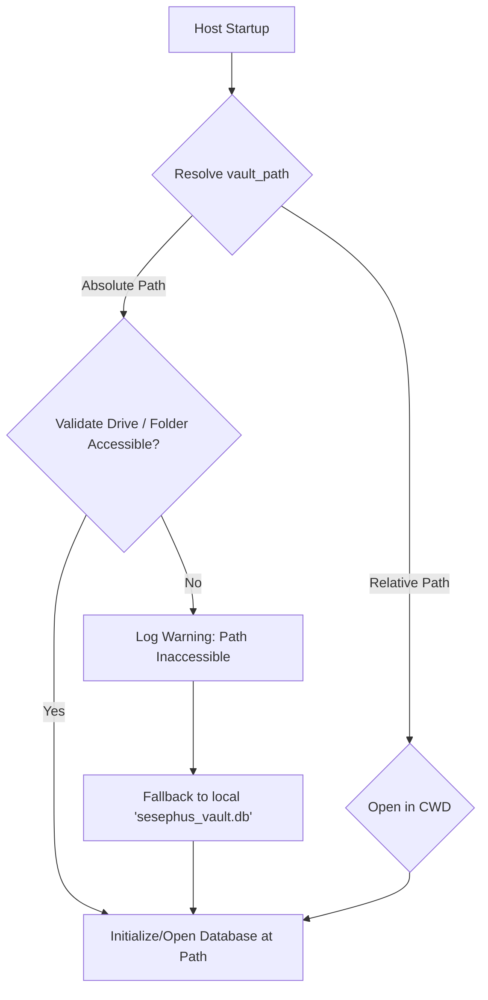
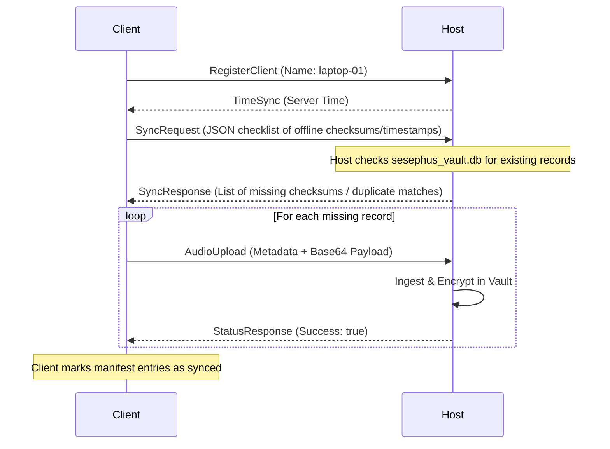
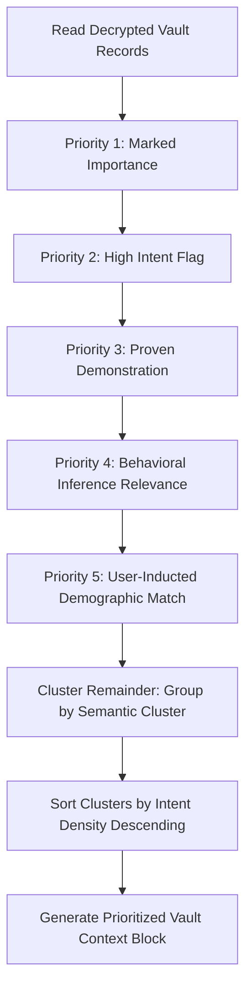

# Sesephus Vault Security & Synchronization Specification

This document details the architectural specifications for the Sesephus encrypted database vault path resolution, fallback policies, verification controls, offline buffering, client-host reconnection synchronization, advanced vault management features (Profiling, Auditing, Shuffling, Refactoring, and Distribution), the Semantic Context Prioritization Model, and the Sidevault Audio Warehousing architecture.

---

## 1. Robust Database Path Resolution & Fallbacks

When the host daemon starts, it resolves the configured path to the encrypted database vault (defaulting to `V:\sesephus_vault.db` via SSFS discipline in drive-mapping.json).

**Use SSFS for drive resolution** (see PRODUCTION.md §5 and ssfs/storage/paths.js + config-engine.js):
- All drive letters come from drive-mapping.json.
- The host now runs SSFS preflight on startup (hard guard on required V: + label match).
- Graceful fallback still exists for the DB but SSFS makes "drive missing" a loud early failure instead of silent data risk.

### 1.1 Drive & Permissions Validation Checks
Before attempting file creation or open operations, the host performs:
1. **Drive Readiness Check:** Verifies if the target drive letter exists in the system namespace (on Windows, using filesystem checks).
2. **Directory Ancestry Check:** Recursively checks if the parent directories of the database path exist; if missing, it attempts to create them.
3. **Write Capability Probe:** Performs a temporary, zero-byte file write/delete test to verify active write permissions.

### 1.2 Graceful Fallback Policy
If any validation check fails, the host:
- Outputs a warning: `[Vault] Warning: Target path '{s}' is inaccessible. Falling back to local './sesephus_vault.db'`.
- Overrides the global `vault_path` to `"sesephus_vault.db"` (relative to current working directory).
- Re-runs the initialization/open logic on the fallback path.

---

## 2. Vault Verification Controls & Key Audits

To prevent directory selection mistakes or loading corrupt database files, Sesephus implements strict cryptographic verification controls.

### 2.1 File Content Verification (Magic Headers)
The host does not accept arbitrary folders or files as vault data. Before opening a file, it reads the first 8 bytes of the file:
- **Magic Check:** The file must start exactly with the magic bytes `SESEPHUS`. If the file is missing or does not start with these magic bytes, the system throws a clean validation error: `[Vault] Error: Specified file does not contain valid Sesephus vault metadata.`
- **Directory Block:** Directories cannot be selected as files. If the user specifies a directory path, the file system check intercepts it and throws an error immediately.

### 2.2 Public Key Validation Check
Sesephus database decryption keys are derived using PBKDF2-HMAC-SHA256. To verify public/private key parity and authenticate access without exposing raw passwords:
- **Public Key Generation:** The host generates a public token derived from the primary vault key.
- **Key Verification Command:** The CLI loop supports `vault_key_verify <key_input>` to check an entered public key string against the active database vault key.
- **Lockout on Failure:** If key verification fails, or if password verification fails to decrypt the database verification block (`VerifySesephusDB`), the host immediately exits with an explicit error status code rather than ignoring the error or hanging.

---

## 3. Offline Client Journal Buffering

When a client device loses network connection to the host daemon, it must buffer all voice journals and telemetry events locally to prevent data loss.

### 3.1 Local Storage Strategy
- **WAV Files:** Offline recordings are stored in a dedicated local directory: `core/sesephus/recordings/`.
- **Local SQLite/JSONL Registry:** The client maintains an offline manifest file (`offline_manifest.jsonl`) containing metadata for unsynced recordings:
  - `timestamp`: Epoch milliseconds.
  - `filename`: Local filename (e.g., `journal_1780578391650.wav`).
  - `action`: Captured event type/metadata.
  - `checksum`: SHA-256 hash of the WAV payload (to prevent duplicate uploads).
  - `synced`: Boolean flag indicating sync status.

---

## 4. Re-connection & Synchronization Protocol

Upon re-establishing a TCP network connection, the client and host execute a synchronization handshake to merge offline journals.

### 4.1 Handshake Sequence
1. **Register Client:** The client connects and sends its `RegisterClient` packet.
2. **Sync Request:** The client reads `offline_manifest.jsonl` and constructs a `SyncRequest` packet listing all unsynced WAV filenames, timestamps, and checksums.
3. **Vault De-duplication:** The host reads the request and queries `sesephus_vault.db` for records matching those timestamps/filenames. It returns a `SyncResponse` detailing which files are missing.
4. **Targeted Upload:** The client uploads only the missing WAV files using `AudioUpload` messages.
5. **Purge Policy:** Once the host acknowledges receipt, the client updates the manifest to `synced: true` and may purge local WAV files if local storage falls below threshold limits.

---

## 5. Advanced Vault Management Operations

The Sesephus suite introduces five core operations for managing, verifying, and distributing encrypted vaults.

### 5.1 Vault Profiling (`vault_profile`)
- **Objective:** Generates detailed structural and content metrics of the database vault.
- **Computed Indicators:**
  - File footprint on disk (bytes).
  - Record density: count of active vs. deleted/corrupted records.
  - Client footprint: breakdown of record counts and byte volumes by client ID.
  - Ciphertext Entropy check: checks the randomness of ciphertext byte blocks. If block entropy is significantly below 8.0, the vault warns of weak cryptographic patterns.

### 5.2 Vault Audit (`vault_audit`)
- **Objective:** Performs an integrity scan across the vault file to detect modification, tampering, or disk corruption.
- **Process:**
  - Verifies the `SESEPHUS` magic header prefix.
  - Walks each encrypted record block sequentially.
  - Verifies the AEAD authentication tag (ChaCha20-Poly1305 tag) for each block using the active vault key.
  - Checks for chronological sequence anomalies or missing blocks (gap detection).
  - Report corrupted offsets or authentication check failures.

### 5.3 Vault Shuffler (`vault_shuffle`)
- **Objective:** Obfuscates database access patterns to resist side-channel or file-size comparison attacks.
- **Process:**
  - Temporarily decrypts all valid records into memory.
  - Permutes (shuffles) the order of record entries.
  - Re-encrypts each record using cryptographically secure random nonces and write them back into a new, consolidated database layout.
  - This alters the database layout, block byte alignments, and ciphertext representations, preventing attackers from mapping updates based on file write diffs.

### 5.4 Vault Refactor (`vault_refactor`)
- **Objective:** Optimizes storage allocation, removes deleted records, and defragments the database.
- **Process:**
  - Gathers all valid records passing audit check.
  - Discards blocks flagged as deleted or containing corrupted data.
  - Writes them contiguously to a fresh vault file.
  - Truncates unused block allocations, reclaiming disk space.

### 5.5 Vault Distribute (`vault_distribute`)
- **Objective:** Shards/partitions the vault across multiple drives or devices for load balancing and redundancy.
- **Process:**
  - **Client Partitioning:** Splits records by Client ID, producing smaller client-specific vault files (e.g. `sesephus_vault_client1.db`).
  - **Verification Block Duplication:** Copies the same `SESEPHUS` magic prefix, salt, and verification block to each sharded file, ensuring they remain valid independent vaults decryptable with the original password.

---

## 6. Vault Context Prioritization & Semantic Clustering Model

When extracting data from the encrypted vault to generate context for host diagnostics or agent behavioral inference, Sesephus applies a multi-level ordering model to place high-relevance shards at the top of the context block, followed by intent-density clustering.

### 6.1 Multi-Level Prioritization Hierarchy
Decrypted records are sorted according to the following strict priority rules:
1. **Marked Importance (`marked_importance == true`):** Key administrative overrides or flagged event actions.
2. **High Intent (`high_intent == true`):** Actions indicating strong user intent.
3. **Proven Demonstration (`proven_demo == true`):** Verified execution runs or confirmed diagnostic actions.
4. **Behavioral Relevance (`behavioral_inference_rel` score descending):** Shards with high correlation scores to behavioral analysis.
5. **Inducted Demographic (`demographic` match):** Records matching the specific user's demographic group (e.g. `developer`, `cyclist`).

### 6.2 Semantic Intent Density Clustering
Records that fall outside the high-priority set are grouped into semantic clusters based on their `semantic_cluster` tag. Inside each cluster:
- Records are sorted in descending order of their `intent_density` score.
- Clusters themselves are ordered by their *average intent density*, ensuring the most semantically dense groups appear immediately below the top-priority context.

---

## 7. Sidevault Audio Warehousing & Structured Ingestion

To keep the database vault file (`sesephus_vault.db`) optimized, high-performance, and lightweight, Sesephus splits raw media storage away from structured metadata records.

### 7.1 Sidevault Directory
A designated directory (`sesephus_sidevault/`) is established immediately adjacent to the vault file:
- If the vault is `V:\sesephus_vault.db`, the sidevault folder resolves to `V:\sesephus_sidevault\`.
- If the vault falls back to `./sesephus_vault.db`, the sidevault folder resolves to `./sesephus_sidevault/`.
- The host ensures this directory exists on startup.

### 7.2 Structured Data Conversion (Ingestion Flow)
When the host receives raw audio data (via network `AudioUpload` or offline folder sync):
1. **Payload Extraction:** The host extracts the raw binary bytes of the WAV audio.
2. **File Warehousing:** The audio is saved as a physical file inside the sidevault directory, using a standardized name: `sesephus_sidevault/journal_[timestamp].wav`.
3. **Metadata Serialization:** The host creates a structured `JournalEntry` record:
   - Sets `local_path` to point to the newly written sidevault file path (e.g., `V:\sesephus_sidevault\journal_1780578391650.wav`).
   - Sets `audio_data_base64` to `""` (empty string) to prevent binary bloat within the SQLite/Vault database.
4. **Encrypted Appending:** The structured metadata record is encrypted and written to `sesephus_vault.db`.

---

## 8. Vault Database Backup Protocols

To protect the Sesephus encrypted vault against file corruption, drive failure, or ransomware, a multi-stage backup protocol is established.

### 8.1 Positional Replication (Hot Backup)
Since the database file is accessed concurrently across multiple threads, stateful copying (`copyFile`) can corrupt the backup if a write occurs mid-operation. Sesephus uses **Positional Backups**:
- During backup, a write lock (`db_write_mutex`) is briefly acquired.
- The host reads the length of the vault database using positional length.
- It copies blocks of data using `readPositionalAll` and writes them sequentially to the backup path `V:\backup\sesephus_vault_bak.db`.
- This ensures that writes occurring after the lock release do not corrupt the backup file.

### 8.2 Offline Archive Copying
- A designated backup folder is specified in configuration (e.g., `C:\Users\bardw\.gemini\antigravity\backups\`).
- Every 1 hour, if the database has changed, the host creates a timestamped snapshot: `sesephus_vault_[timestamp].db`.
- **Integrity Check:** After copying, the host opens the backup copy using the vault key and attempts to read the validation block (`VerifySesephusDB`). If validation fails, the backup is flagged as corrupt, and a warning is logged.
